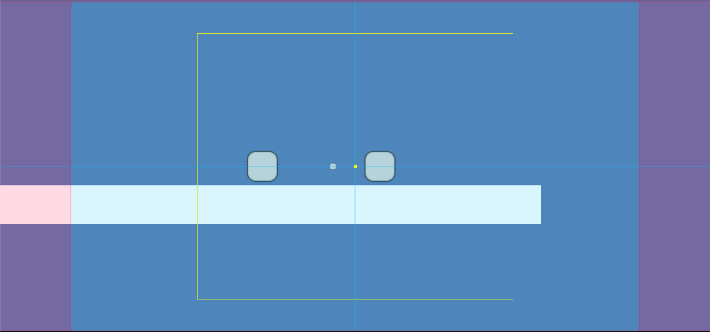

# 镜头跟随，偏移效果
1. FollowTransition
参考卡比的相机偏移效果
尝试一下根据玩家的速度进行相机偏移量的调整。

1. Confiner功能， 多边形管理摄像机的边界
可以注册多个 confiner box，在某一个confiner box范围内时，将边界设置为这个


1. 需要从头开始写相机相关:

首先，要提到Cinemachine Brain组件，它附加在主相机上，负责管理虚拟相机的切换。当切换发生时，Brain会根据设置进行插值，比如位置、旋转的平滑过渡。

通过 priority控制虚拟相机的切换，进行虚拟相机切换时，通过更改 brain组件上的值设置平滑过渡的时间。

Cinemachine支持多种过渡方式，通过Cinemachine Brain的Custom Blends配置：

Cut（立即切换）：无过渡，直接切换到目标相机（优先级最高时）。

Linear（线性过渡）：匀速插值位置和旋转。

Ease In/Out（缓入缓出）：开始和结束时速度较慢，中间较快。

Custom Curve（自定义曲线）：通过动画曲线控制过渡速度。


## Cinemachine的核心
1. 相机的混合与切换 --- (相机切换的时候怎么过渡)
2. 相机位置(Body)，朝向(Aim) --- 核心概念
3. 绑定算法 --- (相机如何跟随物体)

## Body算法种类
1. Do nothing，自己写脚本控制相机运动。
2. Transposer，跟随目标移动，相机和跟随目标相对位置固定
3. Frame Transposer，屏幕空间内保持相机和跟随目标的相对位置，一般用于2D相机
4. Orbital Transposer，以对象为中心的圆内摄像机运动，相机和跟随目标的相对位置是可变的。
可接收用户输入，常用于玩家控制的相机。
Heading可通过Bias设置相机中心点和玩家中心点的偏移

## Aim


DeadZone，目标在此区域不会发生相机移动。
SoftZone，相机跟随目标，尝试让目标回到deadZone中。
No PassZone，目标不会到达的区域。

1. Do Nothing, 脚本控制
2. Composer，保持和相机的偏转
3. Group Composer 调整相机，使得多个对象都能映射出
4. POV，根据相机输入照相机旋转
5. Same As Follow Target
6. Hard Look At

### Group Composer
Frame Size ,控制目标组在画面中的大小。
目标组占据的空间即为下面的黄框。


当目标组的位置或大小发生变化时，Group Composer 会计算出一个新的理想构图位置。Frame Damping 决定了相机从当前位置移动到新位置的速度：

低阻尼值（接近 0）：相机会快速移动到新位置，几乎没有延迟。

高阻尼值（接近 1）：相机会缓慢移动到新位置，移动过程更加平滑。

TODO 阻尼的算法需要学习

## 相机移动到目标位置
```csharp
using UnityEngine;
using Cinemachine;

public class CameraMoveToTarget : MonoBehaviour
{
    public CinemachineVirtualCamera virtualCamera;
    public Transform target;  // 目标点
    public float speed = 5f;  // 移动速度

    private void Update()
    {
        if (virtualCamera != null && target != null)
        {
            // 获取虚拟相机的CinemachineTransposer组件
            var transposer = virtualCamera.GetCinemachineComponent<CinemachineTransposer>();
            if (transposer != null)
            {
                // 平滑地移动相机到目标位置
                Vector3 targetPosition = target.position;
                transposer.m_FollowOffset = Vector3.Lerp(transposer.m_FollowOffset, targetPosition - virtualCamera.transform.position, Time.deltaTime * speed);
            }
        }
    }
}

```